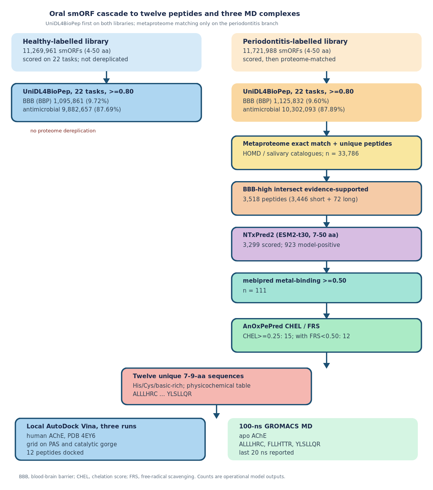
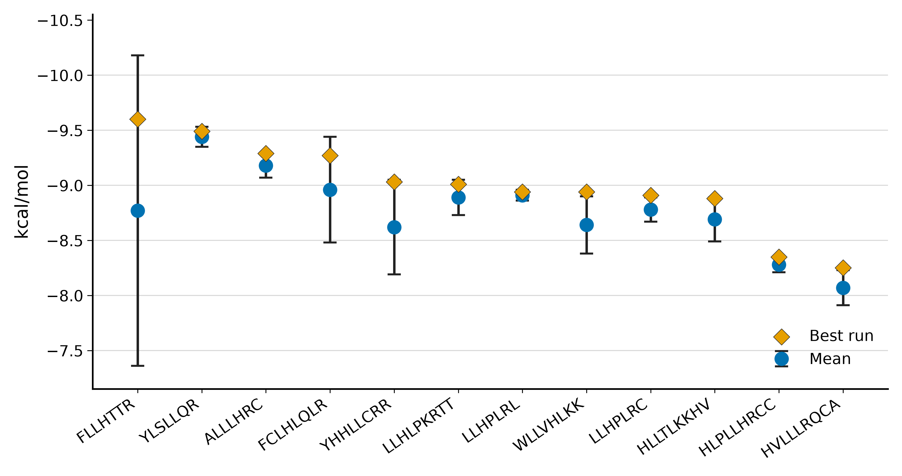
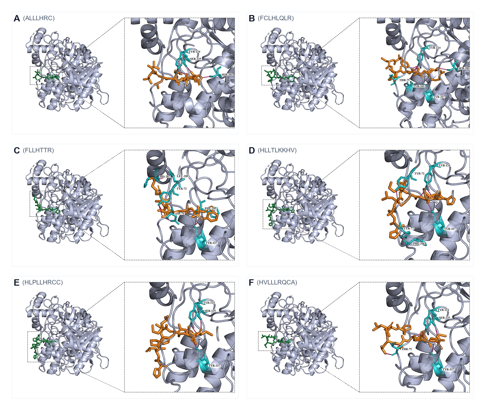

# 牙周炎口腔smORF来源微肽占据AChE外周位点：22项UniDL4BioPep打分、对接与100 ns动力学

## 摘要

牙周炎与阿尔茨海默病（AD）在临床和实验中有关联，但仍缺少能够作用于突触酶的肽水平配体。本研究对已处理好的口腔小开放阅读框（smORF）做 UniDL4BioPep 打分，将 12 条 7–9 残基肽对接到人源乙酰胆碱酯酶（AChE，PDB 4EY6），并对 apo AChE 与三种复合物做 100 ns 分子动力学（MD）。健康标记库 11,269,961 条与牙周炎标记库 11,721,988 条均按 ≥0.80 跑完 22 个分类头。随后仅对牙周炎分支与口腔基因组、宏蛋白质组目录做精确匹配。血脑屏障（BBB）阳性在健康库为 1,095,861 条（9.72%），在牙周炎库为 1,125,832 条（9.60%）。牙周炎 BBB 集合与 33,786 条目录支持的独特肽取交集得 3,518 条；经 NTxPred2、mebipred 与 AnOxPePred 收至 12 条明示序列。12 条在 pH 7.4 均带净正电荷。本地 AutoDock Vina（三次）最优构象介于 −8.25 至 −9.60 kcal/mol。FLLHTTR、YLSLLQR 与 LLHPLRL 接触外周阴离子位点（PAS）。100 ns 内 FLLHTTR 与 YLSLLQR 复合物比 apo 更紧凑（骨架 RMSD 0.1640、0.1625 nm，相对 apo 0.1897 nm）。FLLHTTR 氢键网最密（7.03 ± 1.28）；仅 YLSLLQR 收缩溶剂可及面积。计算勾勒出口腔微肽占据促 Aβ 成纤同一 PAS 的可能路径。

**关键词：** 阿尔茨海默病；牙龈卟啉单胞菌；牙周炎；smORF；微肽；乙酰胆碱酯酶；外周阴离子位点；UniDL4BioPep；分子对接；分子动力学

## 引言

AD 并非单一线性级联。淀粉样、tau、胆碱能缺失、免疫激活与血管损伤并行[@scheltens2021alzheimer]。淀粉样仍居中心：APP 加工产生 Aβ40/Aβ42，寡聚体损伤突触，家族性 APP/PSEN 突变改变 Aβ 长度与产量[@selkoe2016amyloid]。基底前脑乙酰胆碱丢失解释相当部分认知表型，故 AChE 抑制剂仍在常规使用[@hampel2018cholinergic]。对该酶而言，催化并非全部。AChE 经 PAS 加速 Aβ 成纤，AChE–Aβ 颗粒毒性高于游离 Aβ[@inestrosa1996ache]。一段疏水 PAS 基序即足以驱动这种伴侣效应[@deferrari2001motif]。PAS 因此是胆碱能衰竭与淀粉样沉积之间的结构铰链。

慢性牙周炎维持低度炎症负荷，并使微生物产物进入血液[@chalmers2025primer]。口腔活动具物种和位点特异性，16S 丰度不能替代分子配体[@belstrom2021periodontitis]。牙龈卟啉单胞菌的牙龈蛋白酶与外膜囊泡是一对研究较充分的毒力因子[@guo2010gingipain; @ho2015omv]。综合分析把牙周病与认知障碍联系起来，效应随病例定义而变动[@larvin2023periodontalcognition]。AD 队列中牙周炎与后续下降相关[@ide2016periodontitis]。AD 脑内曾检出 *P. gingivalis* 与牙龈蛋白酶[@dominy2019pgingivalis]，小鼠反复口腔感染可产生神经炎症和 Aβ 相关改变[@ilievski2018oral]。若短口腔肽能落在 AChE 上，这一暴露背景便具有机制意义[@hu2024mendelian]。

微生物组 smORF 编码大量尚未绘图的小蛋白[@sberro2019smallgenes; @durrant2021sorf]。7–9 aa 牙周炎肽能否占据 Aβ 结合 PAS，是结构问题。加速 MD 把 Aβ 拉到 AChE 表面，并把该酶视为成核中心[@lushchekina2017amd]。1 μs、以 PAS 为中心的 AChE–Aβ 轨迹保持结合，主驻留区为 344–361[@atanasova2020md]。PAS 导向小分子可在试管中阻断 AChE 诱导的 Aβ 聚集[@bartolini2003pas]。PDB 4EY6 提供 2.40 Å 人源 AChE 框架[@cheung2012ache]。连接催化三联体与 PAS 的芳香峡部早先在电鳗 AChE 上被定位[@kryger1999e2020]。

因此提出三个相连问题。第一，两库完成 22 项 UniDL4BioPep 打分后，目录匹配还留下哪些牙周炎肽？第二，漏斗中的 12 条 7–9 aa 序列是否接触人源 AChE 的 PAS？第三，其中三种复合物能否在 100 ns 内表面驻留且不使酶解折叠？

## 材料与方法

### 研究设计

工作为纯计算。未新增患者、标本、测序或湿实验。健康与牙周炎标记是文库标签，不是肽水平临床诊断。对接使用本地三次 AutoDock Vina 构象。MD 使用 apo AChE 与三种肽复合物的 100 ns GROMACS 轨迹。

### 来源文库

4–50 aa 的翻译 smORF 作为已处理好的肽字符串使用，未重新组装读段或重新预测基因。成对口腔宏基因组与宏转录组的公共来源为 PRJNA678453[@belstrom2021periodontitis]。该 BioProject 另有派生的 MGnify 第三方组装 PRJEB65451（metaSPAdes v3.15.3），并非第二个临床队列。文库规模为健康标记 11,269,961 条、牙周炎标记 11,721,988 条。

### UniDL4BioPep（22 项任务）

两库均先跑 UniDL4BioPep，顺序与近期微生物组抗菌肽挖掘一致[@torres2024peptideantibiotics; @du2023unidl4biopep]。每条肽由预训练 ESM-2 检查点 `esm2_t6_8M_UR50D` 编码为 320 维上下文向量，再经六层、任务特异的卷积网络给出二分类分数。使用的 22 个头为：ACE 抑制、DPP-IV 抑制、苦味、鲜味、抗菌、抗疟（备选）、抗疟（主）、群体感应、抗癌（主）、抗癌（备选）、抗 MRSA、TTCA、BBB（BBP）、抗寄生虫（APP）、NeuroPred、抗细菌、抗真菌、抗病毒、毒性、抗氧化 FRS、致敏性和细胞穿透肽（CPP）。各头阈值均为 ≥0.80。BBB（BBP）≥0.80 是操作性“BBB 高分”标签，不是实测跨细胞转运。其他 BBB 肽分类器采用不同架构与训练集，其发表 AUC 不能直接搬到这些极短口腔序列[@gu2024bbb]。

### 目录匹配（仅牙周炎分支）

打分之后，仅将牙周炎标记序列与口腔基因组、宏蛋白质组资源精确匹配并合并为独特肽。HOMD 与 eHOMD 提供经整理的呼吸道–消化道基因组[@chen2010homd; @escapa2018ehomd]。唾液宏蛋白质组在其自身错误发现框架内记录肽[@belstrom2016metaproteomics]。其他口腔宏蛋白质组集合补充不同临床背景下的序列观察[@jiang2022oralmetaproteomics; @yuan2025osample]。匹配支持该字符串曾经被观察到，不能证明它在 PRJNA678453 样本中表达。牙周炎库得到 33,786 条目录支持的独特肽，与 1,125,832 条牙周炎 BBB（BBP）命中取交集，得到 3,518 条（5–30 aa 3,446；31–50 aa 72）。健康库停留在 22 项打分表，不去冗余。

### NTxPred2

3,518 条集合中 7–50 aa 的肽用 NTxPred2 打分[@rathore2025ntxpred2]。肽模式在神经毒性与非神经毒性序列上微调 ESM2-t30。阳性是模型标签，不是电生理。

### mebipred

mebipred 用工程化序列特征、经两级神经网络估计总体及离子相关金属结合潜力[@aptekmann2022mebipred]。此处 Cu、Fe、Zn 相关输出阈值为 0.50。分数不是实测 Kd，也不是配位几何。

### AnOxPePred

AnOxPePred 是一维卷积多任务网络，训练目标为自由基清除（FRS）与螯合（CHEL）[@olsen2020anoxpepred]。串联截断为 CHEL≥0.25，再加 FRS<0.50，再加 FRS<0.45。UniDL4BioPep、NTxPred2、mebipred 与 AnOxPePred 的一致只是分诊，不是正交生物学。

### 理化描述符

对 12 条互不重复的 7–9 aa 字符串重新计算长度、组氨酸、半胱氨酸、Arg+Lys、平均分子量、等电点、pH 7.4 净电荷、Kyte–Doolittle GRAVY、Ikai 脂肪族指数、疏水残基比例（A、I、L、M、F、V、W、Y）和 Boman 指数。标度只作用于氨基酸字符串，未做 HPLC 或 CD。

### 分子对接

人源重组 AChE（PDB 4EY6，2.40 Å）去除加兰他敏与结晶水，修复链断裂，并按 pH 7.4 分配质子化[@cheung2012ache]。12 条配体 ALLLHRC、FCLHLQLR、FLLHTTR、HLLTLKKHV、HLPLLHRCC、HVLLLRQCA、LLHLPKRTT、LLHPLRC、LLHPLRL、WLLVHLKK、YHHLLCRR 和 YLSLLQR 用 AutoDock Vina 对接，exhaustiveness = 32[@trott2010vina; @eberhardt2021vina]。网格以 PAS（Tyr72、Asp74、Thr75、Leu76、Trp286、His287、Tyr341）为中心，覆盖峡部颈（Phe295）、胆碱亚位点（Trp86、Glu202、Tyr337）和催化三联体（Ser203、His447、Glu334）。每条配体跑三次。报告最优单次亲和力、三次均值±SD、氢键数和最优构象的 PAS 接触。Vina 分数用于排序，不是实验自由能。

### 分子动力学

四个显式溶剂体系在 GROMACS 中以 Amber99SB-ILDN 和 TIP3P、0.15 M NaCl 构建[@abraham2015gromacs; @lindorfflarsen2010amber]：apo AChE（A 链）以及 ALLLHRC、FLLHTTR、YLSLLQR 复合物。盒子为三斜，溶质至壁缓冲 1.0 nm。平衡为 2,000 步最速下降、1.0 ns 受限 NVT 升至 300 K、1.0 ns 受限 NPT 和 1.0 ns 自由 NPT。生产相 100 ns（dt = 2.0 fs），300 K、1.0 bar，LINCS、1.2 nm 截断和粒子网格 Ewald。每 20 ps 存一帧。

与图5–7对齐的指标包括 Cα RMSD、逐残基 RMSF、SASA、Rg、DSSP 占有率和分子间氢键（`gmx hbond`；供体–受体 ≤ 3.0 Å）。另记录微肽自拟合 RMSD 和持续性接触（7.0 Å）。均值±SD 取最后 20 ns（80–100 ns）。方案沿用 Atanasova 等 AChE–Aβ MD 的逻辑，窗口为 100 ns 而非 1 μs[@atanasova2020md]。

## 结果

### 两库 22 项 UniDL4BioPep 任务

图1概括筛选。两库均按 ≥0.80 跑完 22 个头（表1、表2）。命中率接近。抗菌在牙周炎库为 10,302,093/11,721,988（87.89%），健康库为 9,882,657/11,269,961（87.69%）。BBB（BBP）分别为 1,125,832（9.60%）与 1,095,861（9.72%）。抗寄生虫（APP）和群体感应次之；两库最小的都是 DPP-IV 抑制。标签可重叠。两库 BBB 率只差 0.12 个百分点，故 BBB 高分不是牙周炎特异印记。下游对接只用牙周炎分支。

**表1. 牙周炎标记库（11,721,988 条 smORF）的 UniDL4BioPep 计数（≥0.80）。**

| 序号 | 任务 | n | % |
| --- | --- | ---: | ---: |
| 1 | ACE 抑制 | 1,236,442 | 10.55 |
| 2 | DPP-IV 抑制 | 139,056 | 1.19 |
| 3 | 苦味 | 1,831,185 | 15.62 |
| 4 | 鲜味 | 3,100,811 | 26.45 |
| 5 | 抗菌 | 10,302,093 | 87.89 |
| 6 | 抗疟（备选） | 695,608 | 5.93 |
| 7 | 抗疟（主） | 2,010,724 | 17.15 |
| 8 | 群体感应 | 4,491,507 | 38.32 |
| 9 | 抗癌（主） | 2,357,718 | 20.11 |
| 10 | 抗癌（备选） | 2,015,652 | 17.20 |
| 11 | 抗 MRSA | 843,977 | 7.20 |
| 12 | TTCA | 2,666,759 | 22.75 |
| 13 | 血脑屏障（BBP） | 1,125,832 | 9.60 |
| 14 | 抗寄生虫（APP） | 5,462,493 | 46.60 |
| 15 | NeuroPred | 1,714,373 | 14.63 |
| 16 | 抗细菌 | 2,597,877 | 22.16 |
| 17 | 抗真菌 | 2,960,118 | 25.25 |
| 18 | 抗病毒 | 3,275,203 | 27.94 |
| 19 | 毒性 | 1,714,299 | 14.62 |
| 20 | 抗氧化 FRS | 2,521,106 | 21.51 |
| 21 | 致敏性 | 1,713,798 | 14.62 |
| 22 | 细胞穿透肽（CPP） | 925,627 | 7.90 |

**表2. 健康标记库（11,269,961 条 smORF）的 UniDL4BioPep 计数（≥0.80）。**

| 序号 | 任务 | n | % |
| --- | --- | ---: | ---: |
| 1 | ACE 抑制 | 1,237,451 | 10.98 |
| 2 | DPP-IV 抑制 | 131,426 | 1.17 |
| 3 | 苦味 | 1,840,368 | 16.33 |
| 4 | 鲜味 | 3,094,287 | 27.46 |
| 5 | 抗菌 | 9,882,657 | 87.69 |
| 6 | 抗疟（备选） | 703,632 | 6.24 |
| 7 | 抗疟（主） | 1,954,667 | 17.34 |
| 8 | 群体感应 | 4,161,825 | 36.93 |
| 9 | 抗癌（主） | 2,404,084 | 21.33 |
| 10 | 抗癌（备选） | 1,979,643 | 17.57 |
| 11 | 抗 MRSA | 769,955 | 6.83 |
| 12 | TTCA | 2,618,849 | 23.24 |
| 13 | 血脑屏障（BBP） | 1,095,861 | 9.72 |
| 14 | 抗寄生虫（APP） | 5,517,278 | 48.96 |
| 15 | NeuroPred | 1,690,436 | 15.00 |
| 16 | 抗细菌 | 2,658,234 | 23.59 |
| 17 | 抗真菌 | 3,128,057 | 27.76 |
| 18 | 抗病毒 | 3,362,295 | 29.83 |
| 19 | 毒性 | 1,725,268 | 15.31 |
| 20 | 抗氧化 FRS | 2,643,538 | 23.46 |
| 21 | 致敏性 | 1,635,019 | 14.51 |
| 22 | 细胞穿透肽（CPP） | 1,029,770 | 9.14 |

**图1. 筛选级联。** 两库均先跑 UniDL4BioPep（22 项）。目录匹配与后续过滤只用于牙周炎分支，最终 12 条 7–9 aa 肽做对接，3 个复合物做 100 ns MD。

### 牙周炎漏斗至 12 条序列

牙周炎库目录匹配保留 33,786 条独特肽，与 BBB 高分交集得 3,518 条。NTxPred2 评价 3,299/3,518（93.77%），阳性 923/3,299（27.98%）。后续截断留下 mebipred 阳性 111 条、CHEL≥0.25 者 15 条、CHEL≥0.25 且 FRS<0.50 者 12 条、更严 FRS<0.45 者 8 条（表3）。923 条 NTxPred2 阳性肽均 ≤30 aa，故金属/CHEL/FRS 步骤只保留短肽。

**表3. UniDL4BioPep 打分后的牙周炎分支。**

| 阶段 | 规则 | n | 分母 |
| --- | --- | ---: | ---: |
| 牙周炎 smORF | 4–50 aa | 11,721,988 | 文库 |
| BBB（BBP） | 评分 ≥0.80 | 1,125,832 | 11,721,988 |
| 目录支持的独特肽 | 精确匹配 | 33,786 | 11,721,988 |
| BBB 高分 ∩ 目录支持 | 交集 | 3,518 | 1,125,832 ∩ 33,786 |
| 短肽（5–30 aa） | 长度 | 3,446 | 3,518 |
| 长肽（31–50 aa） | 长度 | 72 | 3,518 |
| NTxPred2 已评 | 7–50 aa | 3,299 | 3,518 |
| NTxPred2 阳性 | 模型标签 | 923 | 3,299 |
| mebipred 阳性 | ≥0.50 | 111 | — |
| CHEL 优先 | CHEL≥0.25 | 15 | 111 |
| 主集 | CHEL≥0.25 且 FRS<0.50 | 12 | 111 |
| 更严子集 | CHEL≥0.25 且 FRS<0.45 | 8 | — |

### 12 条肽的理化轮廓

12 条为标准残基组成的互不重复 7–9 aa 肽（表4）。11 条含组氨酸，6 条含半胱氨酸，每条至少 1 个 Arg 或 Lys。分子量 825.03–1,097.30 Da。等电点偏碱（8.28–11.54）。pH 7.4 净电荷全部为正（0.85–2.08）。10 条 GRAVY 为正，与富亮氨酸核心一致；LLHLPKRTT（−0.36）与 YHHLLCRR（−0.95）为两条亲水例外。脂肪族指数从 97.5（YHHLLCRR）到 222.9（LLHPLRL）。YLSLLQR 是唯一不含组氨酸的肽。这些数字描述组成，不是 HPLC 或 CD 实测。

**表4. 12条7–9 aa肽的组成与计算理化描述符。**

| 肽 | aa | MW (Da) | pI | z（pH 7.4） | GRAVY | AI | His | Cys | R+K |
| --- | ---: | ---: | ---: | ---: | ---: | ---: | ---: | ---: | ---: |
| ALLLHRC | 7 | 825.03 | 9.00 | 0.92 | 1.14 | 181.4 | 1 | 1 | 1 |
| FCLHLQLR | 8 | 1029.26 | 9.00 | 0.92 | 0.69 | 146.2 | 1 | 1 | 1 |
| FLLHTTR | 7 | 887.04 | 11.09 | 1.04 | 0.19 | 111.4 | 1 | 0 | 1 |
| HLLTLKKHV | 9 | 1088.35 | 10.63 | 2.08 | 0.08 | 162.2 | 2 | 0 | 2 |
| HLPLLHRCC | 9 | 1091.35 | 8.28 | 0.85 | 0.43 | 130.0 | 2 | 2 | 1 |
| HVLLLRQCA | 9 | 1052.30 | 9.00 | 0.92 | 0.97 | 173.3 | 1 | 1 | 1 |
| LLHLPKRTT | 9 | 1078.32 | 11.54 | 2.04 | −0.36 | 130.0 | 1 | 0 | 2 |
| LLHPLRC | 7 | 851.07 | 9.00 | 0.92 | 0.66 | 167.1 | 1 | 1 | 1 |
| LLHPLRL | 7 | 861.09 | 11.09 | 1.04 | 0.84 | 222.9 | 1 | 0 | 1 |
| WLLVHLKK | 8 | 1036.32 | 10.63 | 2.04 | 0.46 | 182.5 | 1 | 0 | 2 |
| YHHLLCRR | 8 | 1097.30 | 9.91 | 1.96 | −0.95 | 97.5 | 2 | 1 | 2 |
| YLSLLQR | 7 | 892.06 | 9.89 | 0.99 | 0.04 | 167.1 | 0 | 0 | 1 |

### 对人源 AChE 的对接

12 条配体均给出有利 Vina 分数（表5，图2）。最优单次 −8.25 至 −9.60 kcal/mol；三次均值 −8.07 ± 0.16 至 −9.44 ± 0.09 kcal/mol。最优构象排序为 FLLHTTR（−9.60）、YLSLLQR（−9.49）、ALLLHRC（−9.29）。均值排序 YLSLLQR 居首（−9.44 ± 0.09），ALLLHRC 次之（−9.18 ± 0.11）。FLLHTTR 单次最强、SD 最大（−8.77 ± 1.41）。最优构象形成 3–10 个氢键（平均键长 2.83–3.28 Å；图3、图4）。

**表5. 对人源AChE（PDB 4EY6）的三次 AutoDock Vina 打分。**

| 肽 | 氢键 | 最优 | 均值±SD（n=3） | PAS | 主要接触 |
| --- | ---: | ---: | --- | --- | --- |
| ALLLHRC | 3 | −9.29 | −9.18 ± 0.11 | 否 | Ser125, Ser203, Tyr124 |
| FCLHLQLR | 7 | −9.27 | −8.96 ± 0.48 | 是 | Ser203, Thr75, Tyr341 |
| FLLHTTR | 8 | −9.60 | −8.77 ± 1.41 | 是 | Asp74, Tyr72, His287 |
| HLLTLKKHV | 6 | −8.88 | −8.69 ± 0.20 | 是 | Tyr72, Phe346 |
| HLPLLHRCC | 4 | −8.35 | −8.28 ± 0.07 | 否 | Ser125, Tyr124, Tyr337 |
| HVLLLRQCA | 4 | −8.25 | −8.07 ± 0.16 | 是 | Thr75 |
| LLHLPKRTT | 3 | −9.01 | −8.89 ± 0.16 | 邻近 | Ser203, Val340 |
| LLHPLRC | 4 | −8.91 | −8.78 ± 0.11 | 否 | Ser125, Ser293 |
| LLHPLRL | 10 | −8.94 | −8.91 ± 0.05 | 是 | Trp286, Tyr341, His447 |
| WLLVHLKK | 4 | −8.94 | −8.64 ± 0.26 | 否 | Asn283, Gln279 |
| YHHLLCRR | 7 | −9.03 | −8.62 ± 0.43 | 否 | Trp86, Ser203 |
| YLSLLQR | 7 | −9.49 | −9.44 ± 0.09 | 是 | Tyr72, Thr75, Glu202 |

**图2. 对人源AChE（PDB 4EY6）的三次 Vina 打分。** 蓝点为均值，误差棒为 SD，橙菱为最优单次。横轴按最优单次排序。

**图3. 第1–6条肽的最优对接构象（A–F）。** 微肽橙色，接触残基青色。FLLHTTR（C）为最密 PAS 构象。

**图4. 第7–12条肽的最优对接构象（G–L）。** LLHPLRL（I）从 PAS 的 Trp286/Tyr341 跨越至催化 His447。YLSLLQR（L）桥接 PAS 与峡部入口。

最优构象中接触 PAS 的有 FLLHTTR（图3C）、YLSLLQR（图4L）、FCLHLQLR、HVLLLRQCA、HLLTLKKHV 和 LLHPLRL（图4I）。ALLLHRC 结合催化 Ser203，平均氢键最短（2.83 Å），而不是外侧 PAS 芳香核（图3A）。三次均值把跨运行仍强的配体（YLSLLQR、ALLLHRC、LLHPLRL）与最优构象强于运行平均的配体（FLLHTTR、FCLHLQLR、YHHLLCRR）分开。

### apo AChE 与三种复合物的 100 ns 动力学

apo AChE 以及 ALLLHRC、FLLHTTR、YLSLLQR 复合物完成生产相（表6，图5–7）。每幅六面板图比较 apo 与一条复合物：RMSD（A）、RMSF（B）、SASA（C）、Rg（D）、最后 20 ns DSSP（E）和分子间氢键（F）。

<!-- PAGEBREAK -->

**图5. apo AChE 与 AChE–ALLLHRC。** A–F 与表6对应。复合物 RMSD（A）跟随 apo；氢键（F）由早期占有降至后 20 ns 约 2 个。

**图6. apo AChE 与 AChE–FLLHTTR。** 约 50 ns 后复合物 RMSD（A）低于 apo。氢键计数（F）在 100 ns 全程维持约 6–10。

**图7. apo AChE 与 AChE–YLSLLQR。** 后期 RMSD（A）低于 apo。SASA（C）是唯一相对 apo 收缩的复合物。

**表6. apo AChE 与三种复合物最后 20 ns 指标（均值±SD）。**

| 指标 | apo AChE | ALLLHRC | FLLHTTR | YLSLLQR |
| --- | --- | --- | --- | --- |
| Cα RMSD (nm) | 0.1897 ± 0.0090 | 0.1916 ± 0.0092 | 0.1640 ± 0.0080 | 0.1625 ± 0.0078 |
| 微肽自拟合 RMSD (nm) | — | 0.2518 ± 0.0136 | 0.1752 ± 0.0111 | 0.0911 ± 0.0098 |
| RMSF 均值 (nm) | 0.0835 ± 0.0659 | 0.0876 ± 0.0581 | 0.0778 ± 0.0504 | 0.0771 ± 0.0498 |
| SASA (nm²) | 212.25 ± 2.89 | 217.47 ± 2.49 | 213.88 ± 2.36 | 209.71 ± 2.35 |
| Rg (nm) | 2.3045 ± 0.0056 | 2.3107 ± 0.0052 | 2.2967 ± 0.0047 | 2.3028 ± 0.0051 |
| 分子间氢键 | — | 2.19 ± 0.80 | 7.03 ± 1.28 | 2.93 ± 1.14 |
| 持续性接触对 | — | 7 | 7 | 7 |
| DSSP α-螺旋 / β-折叠 (%) | 33.44 / 17.35 | 33.66 / 16.76 | 32.92 / 17.52 | 33.31 / 17.02 |

apo RMSD 平台约 0.19 nm（图5A–7A）。ALLLHRC 跟随对照（复合物 0.1916 nm）。FLLHTTR 与 YLSLLQR 在 50–70 ns 后低于 apo（0.1640 和 0.1625 nm），读作变刚性而非解折叠。微肽自拟合 RMSD 以 ALLLHRC 最高（0.2518 nm）、YLSLLQR 最低（0.0911 nm）。催化核心 RMSF 保持低值；FLLHTTR 与 YLSLLQR 的均值 RMSF 低于 apo。Rg 维持 2.30–2.31 nm。SASA 在 ALLLHRC 升至 217.47 nm²，FLLHTTR 接近 apo（213.88 nm²），仅 YLSLLQR 降至 209.71 nm²（图7C）。氢键历史不同：ALLLHRC 衰减至 2.19 ± 0.80；FLLHTTR 全程维持 7.03 ± 1.28（图6F）；YLSLLQR 均值 2.93 ± 1.14。螺旋（约 33%）与折叠（约 17%）与 apo 柱重叠。各复合物保留 7 对持续性接触。质心 RDF 峰位于 1.22 nm（ALLLHRC）、1.80 nm（FLLHTTR）和 1.62 nm（YLSLLQR），即表面驻留而非本体溶剂。

## 讨论

### 口腔肽经 PAS 通向 AD 的可能路径

AD 把淀粉样沉积与胆碱能衰竭并置[@selkoe2016amyloid; @hampel2018cholinergic]。水解之外，AChE 在 PAS 促进 Aβ 纤丝，AChE–Aβ 复合物毒性高于游离 Aβ[@inestrosa1996ache]。疏水 PAS 基序足以完成该伴侣工作[@deferrari2001motif]，PAS 导向配体可在生化测定中抑制 AChE 驱动的聚集[@bartolini2003pas]。加速 MD 把 Aβ 放到 AChE 表面作为成核中心[@lushchekina2017amd]；1 μs 轨迹使 Aβ 留在 PAS，主要在 344–361[@atanasova2020md]。牙周炎与 *P. gingivalis* 提供暴露路径[@dominy2019pgingivalis; @ilievski2018oral; @chalmers2025primer]。对接与 100 ns 运行表明牙周炎来源微肽可以占据同一 PAS。四步勾勒可能机制。

1. PAS 识别。  
   12 条肽的最优构象集中在 PAS 和峡部入口（图2–4）。FLLHTTR 锚定 Asp74、Tyr72、His287（最优 −9.60 kcal/mol；图3C）。YLSLLQR 接触 PAS（Tyr72、Thr75）与催化入口（均值 −9.44 ± 0.09 kcal/mol；图4L）。LLHPLRL 从 Trp286/Tyr341 跨越至 His447（图4I）。HLLTLKKHV 到达 Tyr72 和 Aβ 驻留区 344–361 中的 Phe346。该几何即 Inestrosa 认定的促纤 PAS，也是 Atanasova 用 Aβ 占据的位点。

2. 持续的酶–肽复合物。  
   100 ns 内折叠保持球状（RMSD 0.16–0.19 nm，Rg 2.30–2.31 nm，螺旋约 33%/折叠约 17%；图5–7）。FLLHTTR 与 YLSLLQR 后期 RMSD 比 apo 更紧，肽停在表面并使蛋白变硬，而不是把它撑开。分子间氢键持续：FLLHTTR 维持密极性网（7.03 ± 1.28；图6F），YLSLLQR 均值 2.93 ± 1.14，ALLLHRC 在早期重排后仍保留 7 对接触。Lushchekina 与 Atanasova 描述过表面结合、不解离的 AChE–Aβ 复合物；口腔微肽在此出现同一模式。

3. 乙酰胆碱进入受限。  
   PAS 位于通向三联体的 20 Å 峡部入口[@hampel2018cholinergic; @cheung2012ache]。占据 Asp74/Tyr72/Trp286/Tyr341 可在催化核心仍折叠时妨碍底物进入（B 面板 RMSF 低）。对接到 PAS 的同一构象因此打中 AD 的胆碱能轴。

4. 病理性伴侣活性。  
   因为 PAS 是已记录的促纤位点[@inestrosa1996ache; @deferrari2001motif]，停在那里的异源肽可降低内源 Aβ 的成核壁垒。FLLHTTR 在 PAS 上提供持续极性网（图6F），与对接构象一致（图3C）。YLSLLQR 埋藏表面（SASA 209.71 对 212.25 nm²；图7C），结合肽最刚（自拟合 RMSD 0.0911 nm）。Lushchekina 的成核中心图景于是映射到这些复合物：折叠的 AChE 出示覆肽 PAS，Aβ 寡聚体可在其上共组装。AChE–Aβ 组装本已比游离 Aβ 更突触毒性[@inestrosa1996ache]；细菌微肽占据同一位点，提供形成杂合晶核的可能路径。

### 从口腔到皮层 AChE

慢性牙周炎可通过上皮破坏、牙龈蛋白酶和囊泡把 *P. gingivalis* 产物送入血液[@guo2010gingipain; @ho2015omv]。细胞因子与蛋白酶增加 BBB 渗漏，因而短、富亮氨酸、带正电且 BBB 高分（该标签在健康库中几乎同样常见）的肽有可能到达间质液[@chalmers2025primer; @dominy2019pgingivalis]。PAS 对接随后在既是胆碱水解酶、又是淀粉样伴侣的酶上给出落点。在这一草图中，12 条序列之所以可称为致病候选，是因为它们占据实验已定位的 Aβ 结合 PAS 并在 100 ns 内保持结合，而不是因为 RMSD 升高。

## 结论

12 条 7–9 aa 牙周炎微肽对接到人源 AChE。FLLHTTR、YLSLLQR 与 ALLLHRC 在 100 ns 内停在表面且不使酶解折叠。FLLHTTR 形成最密 PAS 氢键网；YLSLLQR 是唯一收缩表面积的复合物。对照淀粉样级联[@selkoe2016amyloid]、胆碱能假说[@hampel2018cholinergic]以及 Inestrosa、Lushchekina 与 Atanasova 的 PAS 伴侣实验，这些计算支持一种可能机制：口腔致病肽占据 AChE，妨碍乙酰胆碱进入，并在同一 PAS 上与 Aβ 共成核。

## 参考文献

1. Scheltens P, De Strooper B, Kivipelto M, et al. Alzheimer’s disease. *Lancet*. 2021;397(10284):1577–1590. doi:10.1016/S0140-6736(20)32205-4.
2. Selkoe DJ, Hardy J. The amyloid hypothesis of Alzheimer’s disease at 25 years. *EMBO Mol Med*. 2016;8(6):595–608. doi:10.15252/emmm.201606210.
3. Hampel H, Mesulam MM, Cuello AC, et al. The cholinergic system in the pathophysiology and treatment of Alzheimer’s disease. *Brain*. 2018;141(7):1917–1933. doi:10.1093/brain/awy132.
4. Inestrosa NC, Alvarez A, Pérez CA, et al. Acetylcholinesterase accelerates assembly of amyloid-β-peptides into Alzheimer’s fibrils. *Neuron*. 1996;16(4):881–891. doi:10.1016/s0896-6273(00)80108-7.
5. De Ferrari GV, Canales MA, Shin I, et al. A structural motif of acetylcholinesterase that promotes amyloid β-peptide fibril formation. *Biochemistry*. 2001;40(35):10447–10457. doi:10.1021/bi0101392.
6. Chalmers JC, Hernandez-Kapila YL. The role of the oral microbiome, host response, and periodontal disease treatment in Alzheimer’s disease: a primer. *Periodontol 2000*. 2025;98(1):220–227. doi:10.1111/prd.12631.
7. Belstrøm D, Constancias F, Drautz-Moses DI, et al. Periodontitis associates with species-specific gene expression of the oral microbiota. *npj Biofilms Microbiomes*. 2021;7:76. doi:10.1038/s41522-021-00247-y.
8. Guo Y, Nguyen KA, Potempa J. Dichotomy of gingipains action as virulence factors. *Periodontol 2000*. 2010;54(1):15–44. doi:10.1111/j.1600-0757.2010.00377.x.
9. Ho MH, Chen CH, Goodwin JS, et al. Functional advantages of *Porphyromonas gingivalis* vesicles. *PLoS One*. 2015;10(4):e0123448. doi:10.1371/journal.pone.0123448.
10. Larvin H, Gao C, Kang J, et al. The impact of study factors in the association of periodontal disease and cognitive disorders. *Age Ageing*. 2023;52(2):afad015. doi:10.1093/ageing/afad015.
11. Ide M, Harris M, Stevens A, et al. Periodontitis and cognitive decline in Alzheimer’s disease. *PLoS One*. 2016;11(3):e0151081. doi:10.1371/journal.pone.0151081.
12. Dominy SS, Lynch C, Ermini F, et al. *Porphyromonas gingivalis* in Alzheimer’s disease brains. *Sci Adv*. 2019;5(1):eaau3333. doi:10.1126/sciadv.aau3333.
13. Ilievski V, Zuchowska PK, Green SJ, et al. Chronic oral application of a periodontal pathogen results in brain inflammation, neurodegeneration and amyloid beta production in wild type mice. *PLoS One*. 2018;13(10):e0204941. doi:10.1371/journal.pone.0204941.
14. Hu C, Li H, Huang L, et al. Periodontal disease and risk of Alzheimer’s disease: a two-sample Mendelian randomization. *Brain Behav*. 2024;14(4):e3486. doi:10.1002/brb3.3486.
15. Sberro H, Fremin BJ, Zlitni S, et al. Large-scale analyses of human microbiomes reveal thousands of small, novel genes. *Cell*. 2019;178(5):1245–1259.e14. doi:10.1016/j.cell.2019.07.016.
16. Durrant MG, Bhatt AS. Automated prediction and annotation of small open reading frames in microbial genomes. *Cell Host Microbe*. 2021;29(1):121–131.e4. doi:10.1016/j.chom.2020.11.002.
17. Lushchekina SV, Kots ED, Novichkova DA, Petrov KA, Masson P. Role of acetylcholinesterase in β-amyloid aggregation studied by accelerated molecular dynamics. *BioNanoScience*. 2017;7(2):396–402. doi:10.1007/s12668-016-0375-x.
18. Atanasova M, Dimitrov I, Ivanov S. Molecular dynamics simulations of acetylcholinesterase–beta-amyloid peptide complex. *Cybern Inf Technol*. 2020;20(6):140–154. doi:10.2478/cait-2020-0068.
19. Bartolini M, Bertucci C, Cavrini V, Andrisano V. β-Amyloid aggregation induced by human acetylcholinesterase: inhibition studies. *Biochem Pharmacol*. 2003;65(3):407–416. doi:10.1016/s0006-2952(02)01514-9.
20. Cheung J, Rudolph MJ, Burshteyn F, et al. Structures of human acetylcholinesterase in complex with pharmacologically important ligands. *J Med Chem*. 2012;55(23):10282–10286. doi:10.1021/jm300871x.
21. Chen T, Yu WH, Izard J, et al. The Human Oral Microbiome Database: a web accessible resource for investigating oral microbe taxonomic and genomic information. *Database (Oxford)*. 2010;2010:baq013. doi:10.1093/database/baq013.
22. Belstrøm D, Jersie-Christensen RR, Lyon D, et al. Metaproteomics of saliva identifies human protein markers specific for individuals with periodontitis and dental caries compared to orally healthy controls. *PeerJ*. 2016;4:e2433. doi:10.7717/peerj.2433.
23. Du Z, Ding X, Xu Y, Li Y. UniDL4BioPep: a universal deep learning architecture for binary classification in peptide bioactivity. *Brief Bioinform*. 2023;24(3):bbad135. doi:10.1093/bib/bbad135.
24. Rathore AS, Jain S, Choudhury S, Raghava GPS. A large language model for predicting neurotoxic peptides and neurotoxins. *Protein Sci*. 2025;34(8):e70200. doi:10.1002/pro.70200.
25. Aptekmann AA, Buongiorno J, Giovannelli D, et al. mebipred: identifying metal-binding potential in protein sequence. *Bioinformatics*. 2022;38(14):3532–3540. doi:10.1093/bioinformatics/btac358.
26. Olsen TH, Yesiltas B, Marin FI, et al. AnOxPePred: using deep learning for the prediction of antioxidative properties of peptides. *Sci Rep*. 2020;10:21471. doi:10.1038/s41598-020-78319-w.
27. Trott O, Olson AJ. AutoDock Vina: improving the speed and accuracy of docking with a new scoring function. *J Comput Chem*. 2010;31(2):455–461. doi:10.1002/jcc.21334.
28. Eberhardt J, Santos-Martins D, Tillack AF, Forli S. AutoDock Vina 1.2.0: new docking methods, expanded force field, and Python bindings. *J Chem Inf Model*. 2021;61(8):3891–3898. doi:10.1021/acs.jcim.1c00203.
29. Abraham MJ, Murtola T, Schulz R, et al. GROMACS: high performance molecular simulations through multi-level parallelism from laptops to supercomputers. *SoftwareX*. 2015;1–2:19–25. doi:10.1016/j.softx.2015.06.001.
30. Lindorff-Larsen K, Piana S, Palmo K, et al. Improved side-chain torsion potentials for the Amber ff99SB protein force field. *Proteins*. 2010;78(8):1950–1958. doi:10.1002/prot.22711.
31. Torres MDT, Brooks EF, Cesaro A, et al. Mining human microbiomes reveals an untapped source of peptide antibiotics. *Cell*. 2024;187(19):5453–5467.e15. doi:10.1016/j.cell.2024.07.027.
32. Escapa IF, Chen T, Huang Y, et al. New insights into human nostril microbiome from the expanded Human Oral Microbiome Database (eHOMD). *mSystems*. 2018;3(3):e00187-18. doi:10.1128/mSystems.00187-18.
33. Jiang X, Zhang Y, Wang H, et al. In-depth metaproteomics analysis of oral microbiome for lung cancer. *Research (Wash D C)*. 2022;2022:9781578. doi:10.34133/2022/9781578.
34. Yuan J, Cao Q, Chen M, et al. OSaMPle workflow for salivary metaproteomics analysis reveals dysbiosis in inflammatory bowel disease patients. *npj Biofilms Microbiomes*. 2025;11:63. doi:10.1038/s41522-025-00692-z.
35. Gu Y, Chen P, Wang B, et al. Prediction of blood-brain barrier penetrating peptides based on data augmentation with Augur. *BMC Biol*. 2024;22:86. doi:10.1186/s12915-024-01883-4.
36. Kryger G, Silman I, Sussman JL. Structure of acetylcholinesterase complexed with E2020 (Aricept): implications for drug design. *Structure*. 1999;7(3):297–307. doi:10.1016/s0969-2126(99)80040-9.
